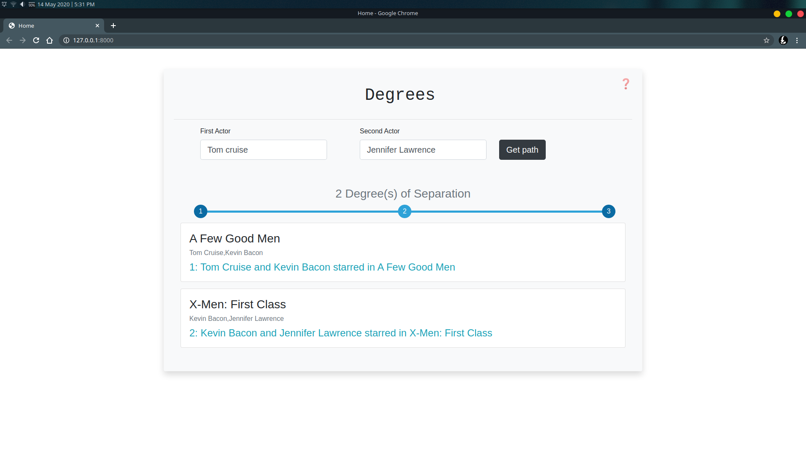

# Degrees of Separation

Find the degrees of separation between two actors using a Search AI!

This app relies on `ajax` to achieve a smooth and no-reload experience.

Built using `Django`, `Python`, `JavaScript` and `JQuery`.

This app would have been easier to make using `Flask` instead of `Django`, but initially I had intended to use Django Models to store all the data.
The ManytoMany relationship capability of Django Models would have made the data retrieval process much more efficient and I wouldn't have to load
all the data in the csv files in to memory every time the server started up.

The problem, however, is that the data in the csv files is just way too big to load in to the models in any reasonable amount of time. Two of the three csv files
have over a million rows and would take literal days to load in to models. 

Django does have a `bulk_create` function to insert rows in to the database, but this
method doesn't add the primary id keys to the rows so ManytoMany relationships would not be possible.

Since I had already set up this app in Django, I just kept it.